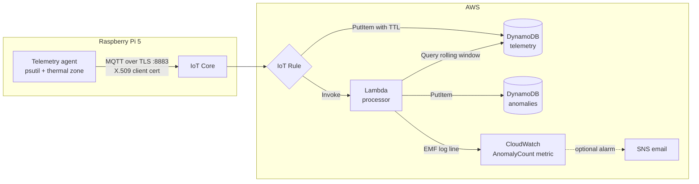

# pi-telemetry

[](https://github.com/Kemoshu/pi-telemetry/actions/workflows/ci.yml)

A Raspberry Pi 5 telemetry pipeline on AWS. A Python agent on the Pi samples
CPU load, memory, disk, and CPU temperature, publishes JSON over MQTT with
mutual TLS to AWS IoT Core, and an IoT rule fans each message out to DynamoDB
for storage and a Lambda for validation, rolling aggregates, and anomaly
detection. Everything on the AWS side is Terraform, so the stack destroys and
rebuilds from scratch.

I built this as a portfolio piece and as hands-on practice for the AWS
Solutions Architect Associate exam. It runs on real hardware: the agent reads
the Pi's actual thermal zone, not synthetic values.

## Architecture

For a component-by-component walkthrough of how everything works and why,
with study notes per section, see [docs/how-it-works.md](docs/how-it-works.md).



Flow, end to end:

1. The agent samples system metrics on a configurable interval and publishes
   a JSON payload to `telemetry/<device_id>` with QoS 1. Temperature comes
   from `/sys/class/thermal`, everything else from psutil.
2. IoT Core authenticates the device with an X.509 certificate. The device
   policy only allows connecting as its own client id and publishing to its
   own topic.
3. An IoT rule selects from `telemetry/+`, computes an `expires_at` TTL
   attribute in rule SQL, writes the raw item to DynamoDB, and invokes the
   Lambda with the same payload.
4. The Lambda validates the payload, queries the last 15 minutes of readings
   to compute rolling averages, writes threshold breaches to the anomalies
   table, and emits an `AnomalyCount` CloudWatch metric via embedded metric
   format log lines.
5. DynamoDB TTL expires raw telemetry after 14 days and anomalies after 90,
   so storage stays flat.

Payload example:

```json
{
  "schema_version": 1,
  "device_id": "pi5-living-room",
  "timestamp": "2026-07-01T18:00:00Z",
  "epoch_ms": 1782950400000,
  "metrics": {
    "cpu_percent": 12.4, "load_1m": 0.38, "load_5m": 0.41, "load_15m": 0.32,
    "memory_percent": 15.8, "memory_used_mb": 1277.2, "memory_total_mb": 8058.9,
    "disk_percent": 31.8, "disk_free_gb": 18.62,
    "uptime_seconds": 2492, "cpu_temp_c": 52.4
  }
}
```

## Repository layout

```
agent/    Pi-side Python package, tests, systemd unit
infra/    Terraform: IoT Core, rule, DynamoDB, Lambda, IAM, CloudWatch
lambda/   Processing function and its moto-backed tests
```

## Prerequisites

- Raspberry Pi (or any Linux box) with Python 3.11+
- An AWS account and the AWS CLI configured with credentials that can create
  IoT, DynamoDB, Lambda, IAM, CloudWatch, and SNS resources
- Terraform >= 1.6
- openssl

## Deploy

### 1. Local setup and tests

```bash
make venv
make test
make run-once   # prints one real payload from this machine
```

### 2. One-time Terraform state backend

The state bucket and lock table live outside the stack so `terraform destroy`
cannot delete its own state. Pick your own globally unique bucket name:

```bash
aws s3api create-bucket --bucket <your-state-bucket> --region us-east-1
aws s3api put-bucket-versioning --bucket <your-state-bucket> \
  --versioning-configuration Status=Enabled
aws s3api put-public-access-block --bucket <your-state-bucket> \
  --public-access-block-configuration \
  BlockPublicAcls=true,IgnorePublicAcls=true,BlockPublicPolicy=true,RestrictPublicBuckets=true
aws dynamodb create-table --table-name <your-lock-table> \
  --attribute-definitions AttributeName=LockID,AttributeType=S \
  --key-schema AttributeName=LockID,KeyType=HASH \
  --billing-mode PAY_PER_REQUEST
```

Then:

```bash
cp infra/backend.hcl.example infra/backend.hcl        # fill in your values
cp infra/terraform.tfvars.example infra/terraform.tfvars
```

### 3. Device key and CSR (on the Pi)

The private key is generated on the device and never leaves it. Terraform
only sees the CSR.

```bash
mkdir -p certs
openssl genrsa -out certs/private.pem.key 2048
openssl req -new -key certs/private.pem.key -out certs/device.csr \
  -subj "/CN=pi5-living-room"
curl -o certs/AmazonRootCA1.pem \
  https://www.amazontrust.com/repository/AmazonRootCA1.pem
```

`certs/` is gitignored. Set `device_csr_path` in `terraform.tfvars` to this
CSR.

### 4. Provision AWS

```bash
cd infra
terraform init -backend-config=backend.hcl
terraform plan     # review before applying
terraform apply
terraform output -raw device_certificate_pem > ../certs/device.pem.crt
terraform output iot_endpoint
cd ..
```

### 5. Install the agent as a service

```bash
sudo mkdir -p /etc/pi-telemetry/certs
sudo cp certs/private.pem.key certs/device.pem.crt certs/AmazonRootCA1.pem \
  /etc/pi-telemetry/certs/
sudo cp agent/config.example.yaml /etc/pi-telemetry/config.yaml
sudo chmod 600 /etc/pi-telemetry/certs/private.pem.key
# edit /etc/pi-telemetry/config.yaml: device_id and the iot_endpoint output
sudo cp agent/systemd/pi-telemetry-agent.service /etc/systemd/system/
sudo systemctl daemon-reload
sudo systemctl enable --now pi-telemetry-agent
journalctl -u pi-telemetry-agent -f
```

Verify data is flowing:

```bash
aws dynamodb query --table-name pi-telemetry-telemetry \
  --key-condition-expression "device_id = :d" \
  --expression-attribute-values '{":d": {"S": "pi5-living-room"}}' \
  --max-items 3 --no-scan-index-forward
```

## Teardown

```bash
sudo systemctl disable --now pi-telemetry-agent
cd infra && terraform destroy
```

The state bucket and lock table are the only leftovers; delete them manually
if you are done for good. `terraform destroy` deactivates and removes the IoT
certificate, so the device cannot reconnect until you provision a new one.

## Cost

Designed to sit at or near zero on a single device publishing once a minute
(about 43k messages a month):

| Service | Usage here | Cost |
|---|---|---|
| IoT Core | 43k messages/month | 12-month free tier covers 500k messages; after that about USD 0.04/month |
| DynamoDB | 86k on-demand writes, small storage | Pennies; 25 GB storage always free |
| Lambda | 43k invocations, 128 MB, arm64 | Always-free tier covers 1M requests and 400k GB-seconds |
| CloudWatch | 1 custom metric via EMF, small logs | First 10 metrics and 5 GB logs free |
| CloudWatch alarm + SNS | only if `enable_temp_alarm = true` | First 10 alarms free, then USD 0.10/month |
| S3 state backend | one small object | Under a cent |

Things that could bill if you scale up: more devices multiply messages and
the per-device EMF metric (USD 0.30/month per metric past 10), shorter
publish intervals multiply everything, and long log retention grows storage.
TTL on both tables keeps DynamoDB storage flat by design.

## SAA-C03 concepts demonstrated

- IoT Core device authentication with X.509 mutual TLS and least-privilege
  IoT policies scoped to client id and topic
- IoT rule actions and SQL for serverless fan-out routing
- DynamoDB key design (partition + sort key for time-series access), TTL,
  and on-demand capacity mode
- Event-driven Lambda with resource-based invoke permissions
- IAM roles and policies scoped per service, action, and resource ARN
- CloudWatch custom metrics via embedded metric format, alarms, and SNS
  notifications
- Terraform remote state on S3 with DynamoDB locking, and why the backend
  lives outside the stack it manages

## Roadmap

- Replace host system stats with a physical BME280 sensor (temperature,
  humidity, pressure) over I2C, keeping the same payload schema with a new
  `schema_version`.
